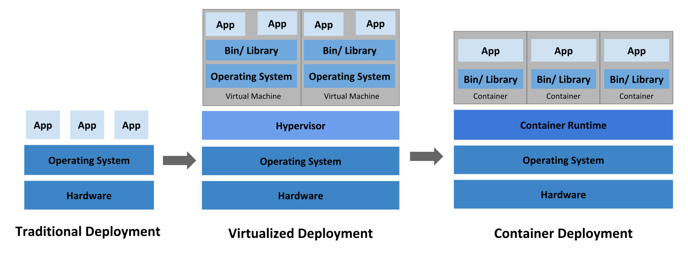
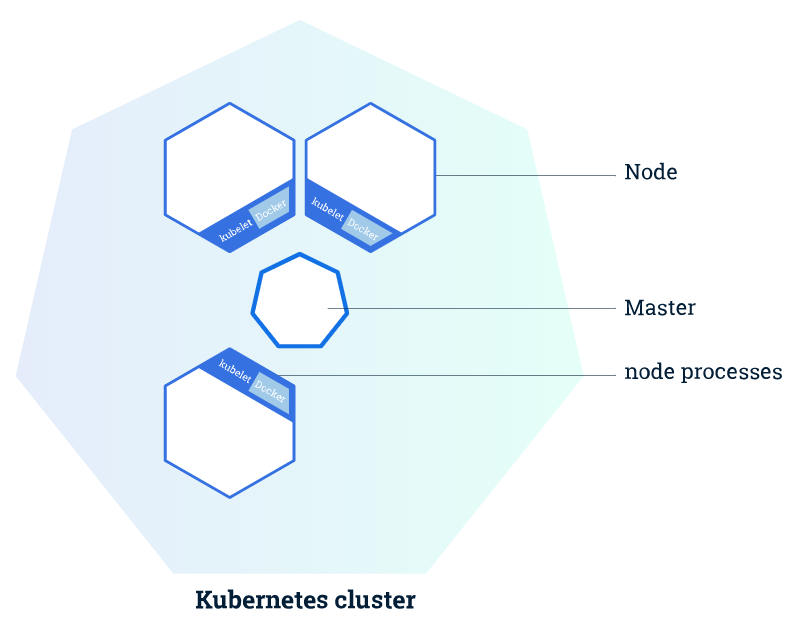
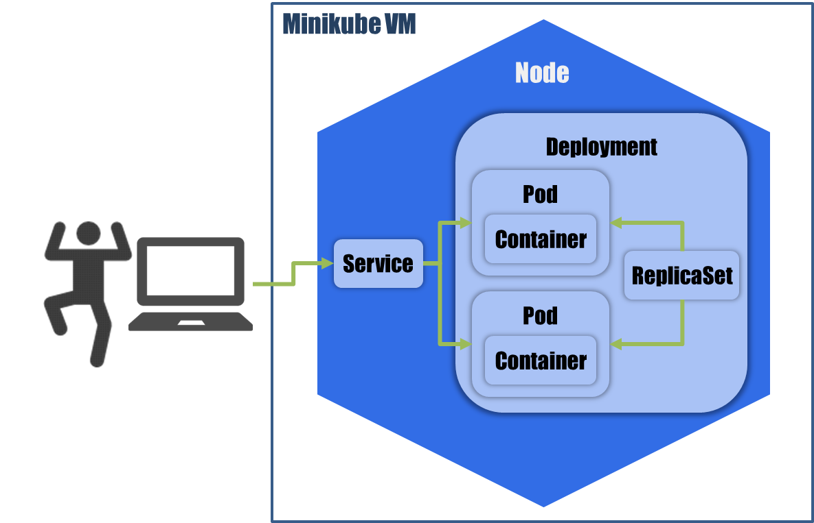

# Indice

* Introduccion
* Puntos a Destacar
* Estructura de Kubernetes
* Estructura del Proyecto
* Demostracion

# Introducción

**¿Qué es Kubernetes?**

Kubernetes fue originalmente un proyecto creado por Google, el cual tiene experiencia de más de 15 años gestionando contenedores. 
Ahora se trata de un proyecto de código abierto, bajo el paraguas de *Cloud Native Computing Foundation (CNCF) y la Fundación Linux*.

**¿Qué significa Kubernetes? ¿Qué significa K8S?**

El nombre Kubernetes proviene del griego y significa timonel o piloto.
Es la raíz de gobernador y de cibernética. 
**K8s** es una abreviación que se obtiene al reemplazar las ocho letras “ubernete” con el número **8**.

# Puntos a destacar
**Ventajas de usar esta tecnologia.**

* Orquestación de contenedores en múltiples hosts, ya que no utiliza contenedores como tal, sino que utiliza agrupaciones de contenedores, lo que se conoce como Pod.
* Escalado y autoescalado: en función del uso de CPU permite el escalado vertical de tus aplicaciones de manera automática o de forma manual (mediante un comando o a través de la interfaz).
* Permite optimizar recursos, definiendo dentro de los Pods qué recursos va a necesitar cada contenedor, como puede ser la cuota de disco duro o el límite de memoria RAM que utilice el propio contenedor.
* Autorreparación: en caso de fallo de un contenedor puede reiniciarlo automáticamente. Puede reemplazar o replanificar contenedores cuando un nodo muere. Y si hay contenedores que no responden a los health checks definidos por el usuario, puede pararlos.
* Podemos automatizar despliegues, saneamientos de contenedores, subida de versión de aplicaciones y un sinfín de cosas más.

# Puntos a destacar
**¿Donde se puede utilizar Kubernetes?**

Las opciones para utilizar Kubernetes apenas tienen restricción.

* Bare Metal: podemos desplegar nuestro cluster directamente sobre máquinas físicas utilizando múltiples sistemas operativos: Fedora, CentOS, Ubuntu, etc.
* Virtualización On Premise: si queremos montar nuestro cluster on premise, pero con máquinas virtuales, las posibilidades crecen. Podemos utilizar Vagrant, CloudStack, Vmware, OpenStack, CoreOS, oVirt, Fedora, etc.
* Soluciones Cloud: Google Container Engine, Azure, IBM, Kube2Go, Kops (AWS)

# Puntos a destacar

**Evolucion de la tecnologia informatica**

* Conforme al paso del tiempo las nuevas tecnologias han evolucionado y han cambiado el mundo de la informatica pasando de:

Servidores fisicos --> Servicios Cloud

# Estructura Kubernetes

**Estructura de un Cluster**

# Estructura Kubernetes

**Conceptos de Kubernetes.**

* Deployment: Una implementación proporciona actualizaciones declarativas para Pods y ReplicaSets.
* Service: Una forma abstracta de exponer una aplicación que se ejecuta en un conjunto de Pods como un servicio de red.
* Pod: es la unidad de ejecución básica de una aplicación de Kubernetes, la unidad más pequeña y más simple en el modelo de objetos de Kubernetes que crea o implementa. Un Pod representa procesos que se ejecutan en suracimo.
* Nodo: nodo contiene los servicios necesarios para ejecutar Pods, incluye el kubelet, container runtime, kube-proxy.
* Master:  es el responsable de mantener el estado deseado de tu clúster. Cuando interactuas con Kubernetes, como por ejemplo cuando utilizas la interfaz de línea de comandos kubectl, te estás comunicando con el master de tu clúster de Kubernetes.

# Esctructura del proyecto

**El proyecto**

Este proyecto necesita varios componentes para su simulacion.

* minikube
* VM: VirtualBox, KVM, Docker, Hyper-V
* cliente: kubectl
* imagenes: DockerHub (por defecto) pero nos sirve cualquier imagen.

# Esctructura del Proyecto.

#  Esctructura del Proyecto.

**Esctructura de Gandhi K8S.**

* Servicio LDAP
* Servicio KRB5
* Servicio SAMBA
* Servicio NFS

# Esctructura del Proyecto.

**Estructura de usuario, el alumno**

Representa la figura de un alumno que se conecta y hace login con sus credenciales en la escuela.

* Container host-samba
* Container host-nfs

# Pasamos a la Demostracion

